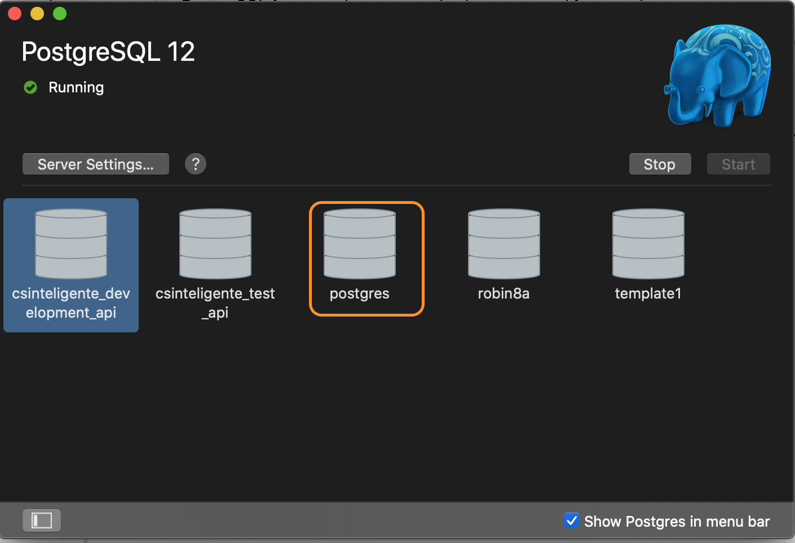
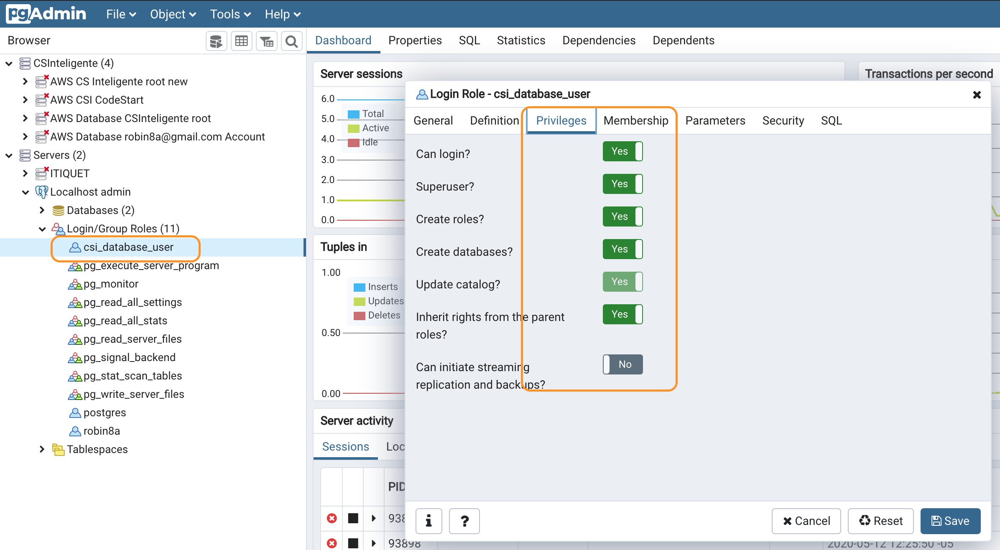

# On Mac Robin

```sh

rvm use ruby-2.5.3
bundle install

```

# Postgres
## Postgres App
1. [Download Postgres App](https://postgresapp.com/)
2. Start
3. Check local the connections 

## PG Admin
1. [Download Postgres admin](https://www.pgadmin.org/)
2. Connect with: (this is admin)
hostname /address: localhost
maintance database: postgres
password: <empty>

### Create user with PG-Admin (UI)
1. Create the user with following role


## Create the database and populate it
```sh
rails db:create
rails db:migrate
```


# Heroku
## Publish or update
```sh
git push heroku master
heroku run rake db:migrate
heroku run rake db:seed
```

- [Heroku Generated](https://arcane-meadow-49804.herokuapp.com/)


Slack, Libardo... 
Documentos
Cuenta de

Que tipo de contrato debo tener con la empresa OPS para los horas trabajadas?
Como debo hacer? 

Manejar de dos formas:

- Honorarios o servicios: 
- Salarios, nomina

Partidas por debajo de 3M

Honorarios mes vencido


